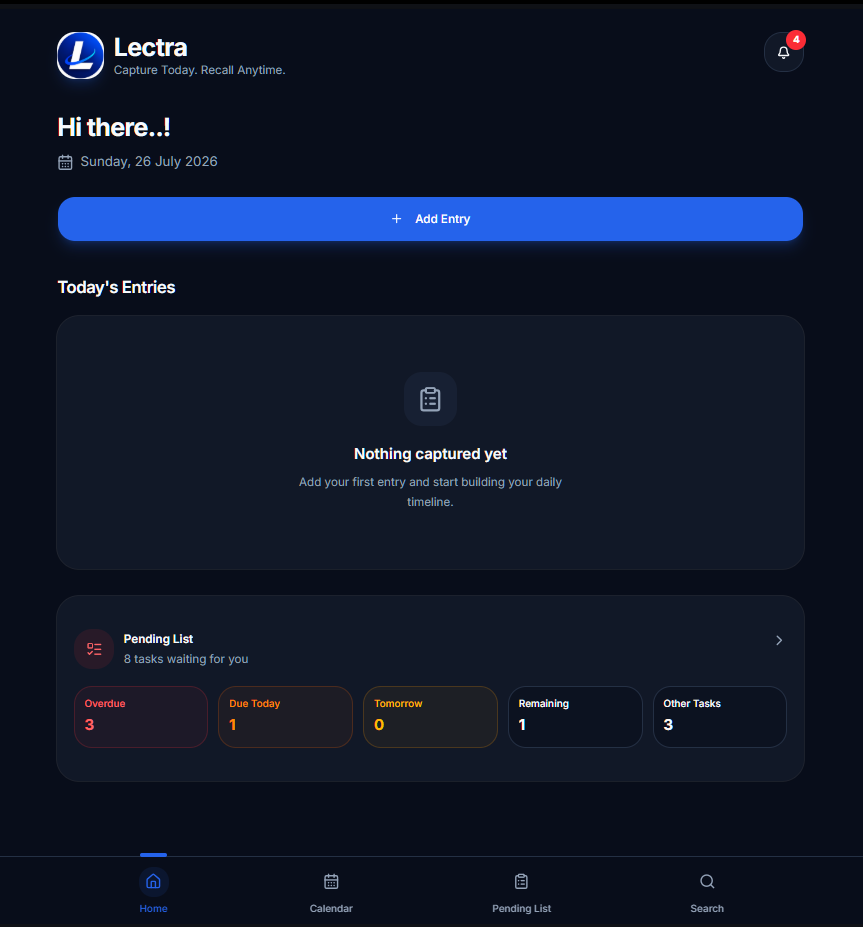
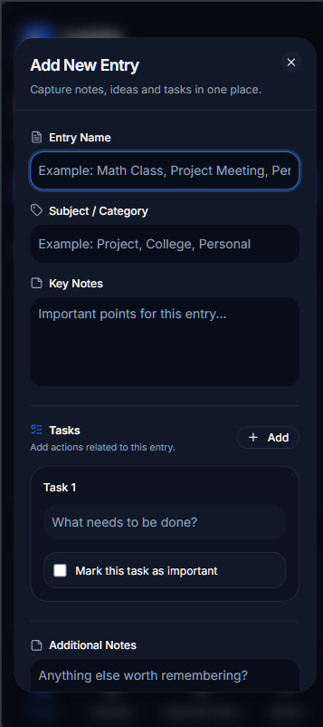
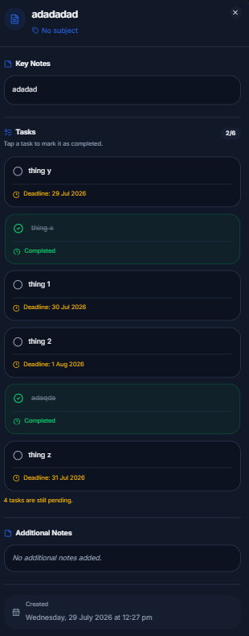
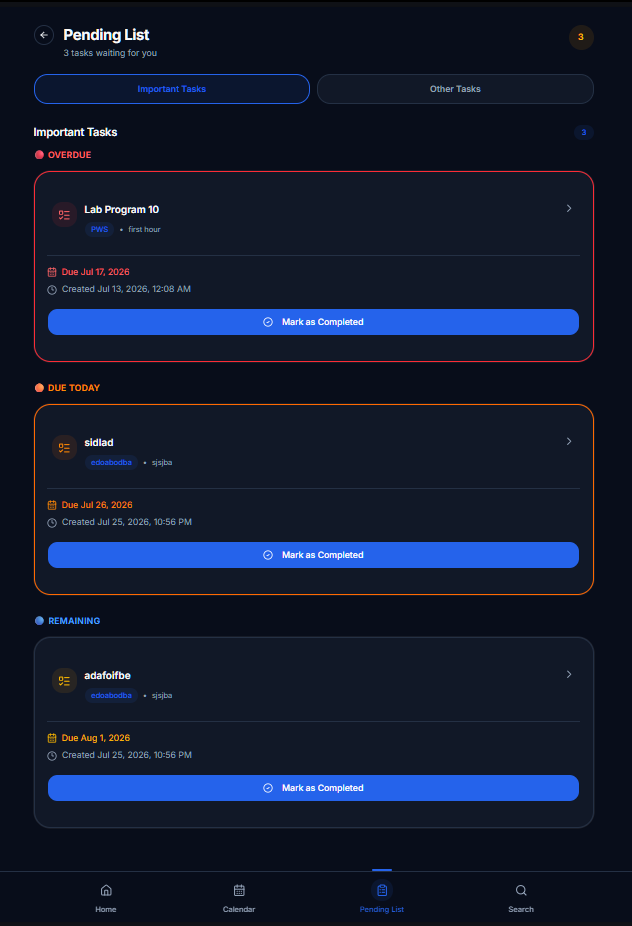
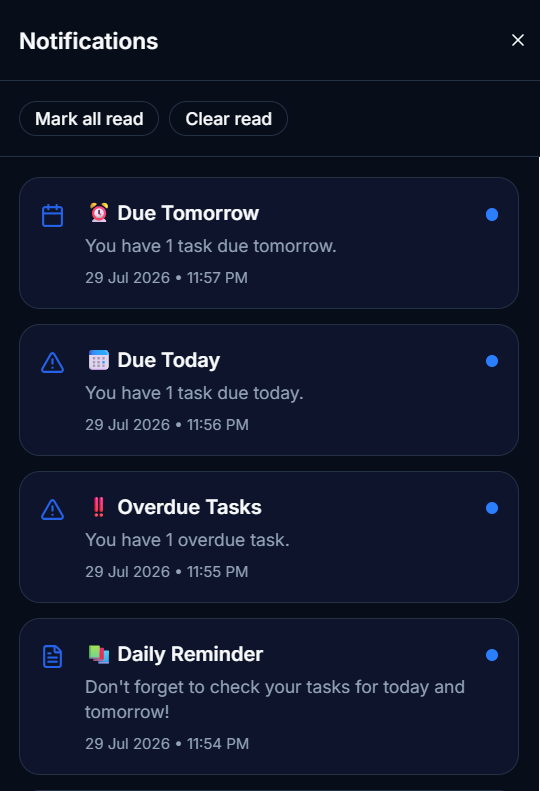
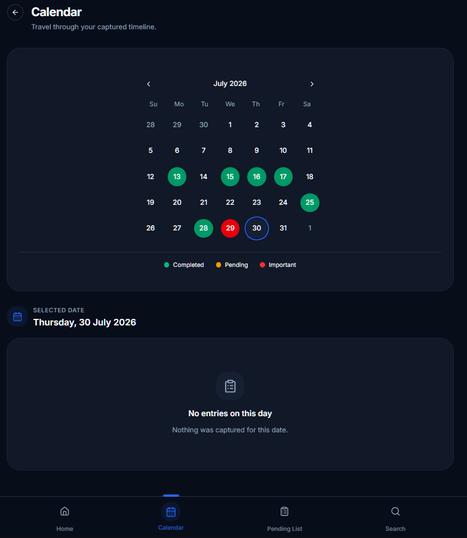
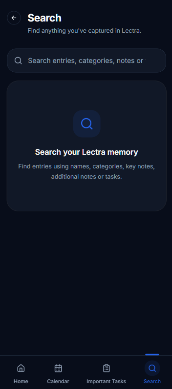

# Lectra

Local-first productivity app for notes, tasks, reminders, scheduling, and notifications, built with Next.js and Capacitor.

## Overview

Lectra brings personal note capture, actionable task tracking with deadlines, versatile reminders, and rich document attachments into a single, distraction-free space. Everything in Lectra runs offline and is stored directly on your device without external servers, tracking, or mandatory accounts.

Whether capturing everyday thoughts, managing project tasks, scheduling one-time or recurring alarms, or viewing photo and PDF attachments, Lectra operates reliably both in the browser and as an installed native Android application.

## Features

### Capture and Entries
- **Quick Capture**: Fast entry creation with title, category/subject, lesson notes, and color-coded tags.
- **Draft Auto-Saving**: Uncommitted entry drafts are automatically saved to local storage to prevent progress loss when navigating away.
- **Backdated Entries**: Support for setting a logical entry date independent of creation time.
- **Interactive Modals**: Polished dialogs for creating, editing, and viewing entries with smooth animations.
- **Tags & Categories**: 12 built-in tags plus support for creating, renaming, and deleting custom tags.

### Tasks and Pending Work
- **Entry-Linked Tasks**: Add multiple work items to any entry with optional deadlines and importance flags.
- **One-Tap Completion with Instant Undo**: Mark tasks completed from the dashboard, pending tasks hub, or view modal with an instant 3.5-second undo toast.
- **Inline Task Creation**: Append tasks directly while viewing an entry without opening the full edit form.
- **Urgency Grouping**: Tasks are automatically categorized into Overdue, Due Today, Tomorrow, Upcoming, and Other.
- **Dedicated Pending Tasks Hub**: Consolidated view (`/pending`) for reviewing and managing all unfinished tasks across entries.

### Attachments and Storage
- **Photo and PDF Support**: Attach images and PDF documents directly to entries (up to 20 MB per file).
- **IndexedDB Binary Storage**: Attachments are stored as binary Blobs in IndexedDB (`lectra_attachments_db`), keeping text storage lightweight.
- **In-App Previews**: Embedded image viewer with zoom/pan and PDF document viewer powered by PDF.js.
- **Device Export**: Export attachments directly to the device's public storage (`Documents/Lectra/` on Android).
- **Storage Management**: Visual breakdown of app data and attachments with one-tap orphaned file cleanup.

### Real-Time Search and Calendar
- **Instant Search**: Real-time search across entry titles, categories, notes, tags, and task descriptions.
- **Calendar Timeline**: Month and day views with dot indicators for completed, pending, and important items, plus horizontal swipe navigation.

### Backup and Restore
- **JSON Backup**: Lightweight export of all entries, tags, notification settings, and notification history.
- **Full ZIP Archive**: Complete backup packaging all application data alongside binary attachment files.
- **Restore Support**: Seamless data restoration from either JSON or full ZIP backup archives.

## Screenshots

| Dashboard | Add Entry |
| :---: | :---: |
|  |  |

| Entry Details | Pending Tasks |
| :---: | :---: |
|  |  |

| Notification Center | Calendar View |
| :---: | :---: |
|  |  |

| Real-Time Search |
| :---: |
|  |

## Notification System

Lectra features a native notification subsystem designed for reliability on Android:

- **Exact Alarm Scheduling**: Scheduled via Android AlarmManager through `@capacitor/local-notifications` with `allowWhileIdle: true` and deterministic 32-bit integer IDs.
- **Custom Reminders**: Set one-time alerts for specific dates and times, or recurring reminders repeating daily, weekly, monthly, or on selected days.
- **Automated Task Deadlines**: Configurable notification timings for Overdue tasks, tasks Due Today, tasks Due Tomorrow, and a Weekly Check-in summary.
- **Snooze & Timing Adjustments**: Quick presets (10 min, 30 min, 1 hour, tomorrow 9am) and custom date/time snooze options. Snoozing a recurring reminder sets a temporary one-time alarm while preserving the parent recurrence schedule.
- **Interactive Action Buttons**: System notifications include actionable buttons:
  - *Task notifications*: **Complete** (marks task done and updates history) and **Remind me** (opens snooze flow).
  - *Reminder notifications*: **Remind me** (opens snooze flow) and **Stop** (disables the reminder).
- **Notification History**: In-app notification center logging delivered alerts with unread tracking, action status badges ("Completed", "Stopped", "Reminded"), and one-tap task completion.
- **Intelligent Reconciliation**: The scheduler synchronizes pending alarms without dropping active one-time notifications when their scheduled time arrives or during app lifecycle transitions. Only explicitly completed, disabled, or deleted items are cancelled.

## Tech Stack

- **Framework**: Next.js 16.3.7 (App Router, static export `output: "export"`, Turbopack)
- **UI Library**: React 19.2.4
- **Language**: TypeScript 5
- **Styling**: Tailwind CSS 4, Radix UI primitives, Lucide React icons (`lucide-react` 1.49.0), Framer Motion (`framer-motion` 12.43.0)
- **Mobile Engine**: Capacitor 8 (`@capacitor/core` 8.4.2, `@capacitor/android` 8.4.2, `@capacitor/cli` 8.4.2)
- **Native Plugins**: `@capacitor/local-notifications` 8.2.1, `@capacitor/filesystem` 8.1.3, `@capacitor/status-bar` 8.0.3, `@capacitor/app` 8.1.1
- **State Management**: Zustand 5.0.15 (with `persist` middleware)
- **Local Databases**: IndexedDB (`lectra_attachments_db`) and `localStorage`
- **Utilities**: date-fns 4.4.0, JSZip 3.10.2, PDF.js (`pdfjs-dist` 6.3.289), Sonner 2.0.8

## Project Structure

```text
├── android/            # Capacitor Android native project & Gradle build files
├── app/                # Next.js App Router static pages (calendar, notifications, pending, search, settings)
├── components/         # Modular React UI components (attachments, dashboard, dialogs, reminders, shared)
├── hooks/              # Custom React hooks (active reminders, pending tasks, upcoming items)
├── public/             # Static web assets (icons, manifest, PDF.js worker)
├── Screenshots/        # Documentation screenshots
├── src/                # Core business logic
│   ├── lib/            # IndexedDB attachment store, backup service, storage metrics
│   └── notifications/  # Native notification scheduler, engine, registry, actions, and history
├── store/              # Zustand state stores (entries, tags, notifications, settings, drafts, theme)
└── types/              # TypeScript interfaces (entry, reminder, tag, notification)
```

## Getting Started

### Prerequisites

- Node.js 18.x or 20.x
- npm (bundled with Node.js)

### Installation

```bash
git clone https://github.com/Vagish23ps/Lectra.git
cd Lectra
npm install
```

### Development Server

Run the local development server:

```bash
npm run dev
```

Open [http://localhost:3000](http://localhost:3000) in your browser.

### Type Check and Linting

Verify TypeScript types:

```bash
npx tsc --noEmit
```

Run ESLint:

```bash
npm run lint
```

### Production Web Build

Compile and generate the static export in the `out/` directory:

```bash
npm run build
```

## Android

Lectra compiles into a native Android app via Capacitor.

### Prerequisites

- Android Studio (Jellyfish, Ladybug, or newer recommended)
- Android SDK Platform 36 (Minimum SDK: 24, Target SDK: 36)
- JDK 17 or JDK 21

### Build and Synchronize

1. Build the static web assets:

```bash
npm run build
```

2. Synchronize web assets and native plugins to the Android project:

```bash
npx cap sync android
```

3. Open the Android project in Android Studio:

```bash
npx cap open android
```

From Android Studio, run the app on an Android Emulator or connected physical device, or generate an APK via **Build > Build Bundle(s) / APK(s) > Build APK(s)**.

## Testing and Validation

The current implementation has been validated across:

| Check | Result | Details |
| :--- | :--- | :--- |
| **TypeScript** | Passed | `npx tsc --noEmit` with 0 errors |
| **ESLint** | Passed | `npm run lint` with 0 errors |
| **Production Build** | Passed | `next build` with 16/16 static routes prerendered |
| **Capacitor Sync** | Passed | Synchronized with all 4 native plugins |
| **Android Notifications** | Verified | Tested on physical Android hardware |

### Android Physical Device Notification Testing
Notification scheduling, actions, and history have been tested and verified on physical hardware under both:
- **"Closed / kept in Recent Apps"**: App is left in Android Recent Apps / Multitasking tray.
- **"Removed from Recent Apps"**: App is explicitly swiped away and dismissed from Recent Apps.

*Note: As with all Android applications utilizing exact alarms, aggressive manufacturer-specific battery managers (e.g. Xiaomi MIUI/HyperOS, Samsung sleeping app policies) may throttle background tasks unless the user disables battery optimization for Lectra.*

## Status

Lectra is in a **stable pre-release state** with all core features, storage subsystems, and notification workflows implemented and verified.

## Future Development

- Automated release version synchronization across `package.json`, Gradle, and the UI.
- Android home screen widgets for quick note capture and urgent task overviews.
- Local peer-to-peer / Wi-Fi device backup sync.

## License

All rights reserved by the author unless explicitly stated otherwise.