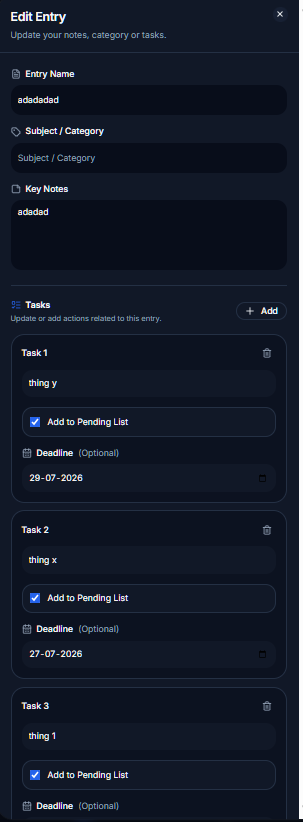

# 📒 Lectra


## 🚀 Live Demo

🌐 https://lectra-psi.vercel.app

> **Capture Today. Recall Anytime.**

Lectra is a modern, mobile-first Progressive Web App (PWA) that combines note-taking, task management, calendar organization, and productivity tools into a single lightweight workspace.

Built with **Next.js**, **TypeScript**, **Tailwind CSS**, and **Zustand**, Lectra helps users capture information quickly, organize tasks efficiently, and revisit previous notes through a clean, distraction-free interface.

---

# ✨ Features

## 📝 Smart Note Management

- Create, edit, view and delete entries
- Organize notes using custom categories
- Key Notes for quick highlights
- Additional Notes for detailed information
- Automatic Local Storage persistence
- Clean dialog-based workflow

---

## ✅ Intelligent Task Management

Each entry can contain multiple tasks.

Features include:

- Mark tasks as Important
- Optional deadlines
- Mark tasks as completed
- Automatic deadline sorting
- Open the original entry from any task
- Completion tracking

Tasks are automatically organized into:

- 🔴 Overdue
- 🟠 Due Today
- 🟡 Tomorrow
- 🔵 Remaining
- 📌 Important Tasks without Deadline
- 📄 Other Tasks

---

## 📊 Productivity Dashboard

The dashboard provides an overview of your work including:

- Today's Entries
- Pending Task Summary
- Overdue Counter
- Due Today Counter
- Tomorrow Counter
- Remaining Counter
- Other Tasks Counter
- Quick Add Entry
- Notification Center

Each task category is clickable and opens the corresponding section in the Pending page.

---

## 🔔 Smart Notifications

Receive reminders for:

- Overdue tasks
- Tasks due today
- Upcoming deadlines

Notifications can be viewed directly from the dashboard.

---

## 📅 Calendar

- Browse entries by date
- Highlight days containing notes
- View previous entries instantly
- Timeline-based navigation

---

## 🔍 Smart Search

Instantly search using:

- Entry Name
- Category
- Key Notes
- Additional Notes
- Tasks

Results update in real time.

---

## 📱 Progressive Web App

- Installable on Desktop
- Installable on Android
- Offline Support
- Native App Experience
- Responsive Design
- Fast Loading

---

## 💾 Data Storage

- Local Storage
- Automatic Saving
- Persistent Data
- Works Offline
- No Account Required

---

# 🖼️ Screenshots

| Dashboard | Add Entry |
|-----------|-----------|
|  |  |

| Calendar | Search |
|----------|--------|
|  |  |

| Pending Tasks | Notifications |
|---------------|---------------|
|  |  |

| View Entry | Edit Entry |
|------------|------------|
|  |  |

---

# 🛠️ Tech Stack

| Technology | Purpose |
|------------|---------|
| Next.js 16 | React Framework |
| React | UI Library |
| TypeScript | Type Safety |
| Tailwind CSS | Styling |
| shadcn/ui | UI Components |
| Zustand | State Management |
| date-fns | Date Utilities |
| Lucide React | Icons |
| PWA | Offline & Installable |

---

# 📂 Project Structure

```text
app/
components/
store/
types/
lib/
public/
```

---

# 🚀 Getting Started

Clone the repository

```bash
git clone https://github.com/Vagish23ps/Lectra.git
```

Move into the project

```bash
cd Lectra
```

Install dependencies

```bash
npm install
```

Run the development server

```bash
npm run dev
```

Visit

```
http://localhost:3000
```

---

# 📱 Current Features

- Dashboard
- Daily Timeline
- Add Entry
- View Entry
- Edit Entry
- Delete Entry
- Calendar View
- Smart Search
- Notification Center
- Pending Dashboard
- Deadline Categorization
- Important Tasks
- Other Tasks
- Task Completion
- Deep Linking from Dashboard
- Responsive Design
- Dark Theme
- Local Storage
- Offline Support
- Installable PWA

---

# 🚀 Roadmap

## Version 1.2

- File Attachments
- Image Notes
- Rich Text Editor
- Export & Import Data
- Multiple Themes
- Better Search Filters
- Bulk Task Actions

---

## Version 2.0

- Firebase Cloud Sync
- Google Authentication
- Cross-device Synchronization
- AI Study Assistant
- AI Note Summaries
- AI Task Suggestions
- Semester Analytics
- Productivity Insights
- Backup & Restore

---

# 🎯 Motivation

Lectra was built to simplify note-taking by bringing notes, tasks, reminders, calendar organization, and productivity tracking into one lightweight application.

Instead of switching between multiple apps, Lectra provides a focused workspace where information can be captured quickly and recalled effortlessly.

---

# 🤝 Contributing

Contributions, suggestions and feature requests are always welcome.

1. Fork the repository
2. Create a feature branch
3. Commit your changes
4. Open a Pull Request

---

# 👨‍💻 Developer

**Vagish**

Engineering Student

**Branch:** IoT • Cybersecurity with Blockchain

GitHub

https://github.com/Vagish23ps

---

# 📄 License

Licensed under the MIT License.

Feel free to use, modify and learn from this project.

---

# ⭐ Support

If you found Lectra useful, consider giving the repository a ⭐ on GitHub.

Every star helps the project reach more developers and motivates future improvements.